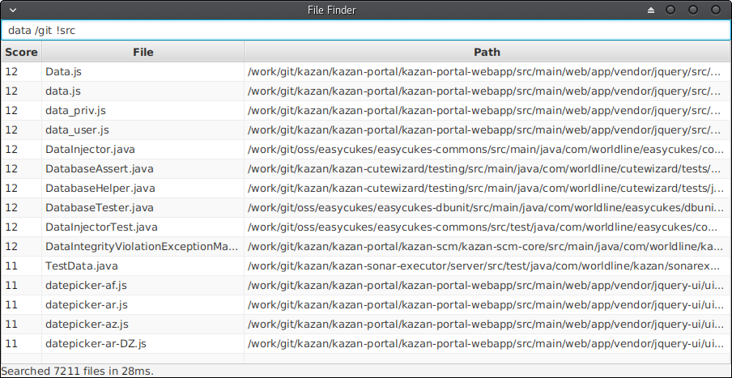

# File-Finder

  

## About

File-Finder is a simple tiny tool for searching through files on your computer.

It aims at letting you searchTextProperty through various directories, and retrieve files not only typing their names, but using kind of patterns as well. Its goal is to let you do everything from the keyboard (so not having to use your mouse) for being as quick as possible.

## Installation and Execution

You can simply download the jar from the download link above (filefinder-ui.jar) and execute it with Java (Java 8 at least should be installed).

You can run it with `java -jar filefinder-ui.jar` or simply double-click on it if Java is set to execute jars by default (our jar is an executable one).

## Research Patterns

Basically what we mean by pattern is that you don't have to write the exact full name of the file you're looking for, and you can ommit some parts.

For example, you could type `DBM.java` for searching a file called `DataBaseManager.java`.

It also tries to deal with typos and will actually calculate which are the files which are more likely to match with your reseach.

For example, typing `DatavbaseMan` for searching a file called `DatabaseManager` will actually still find your file!

In any case, a score is computed for each file in order to select which one is fitting your criterias.

## Score calculation

The rules are actually fairly simple:

- The less errors you have, the better the score will be,
- The closer letters are from each other, the better the score will be,

Meaning that for example, by typing `abc`, the file named `abc.txt` will get a higher score than `azbzcz.txt` cause the letters are closer to each other. The other file will be proposed as well though.

## Keyboard shortcuts

Typing researches and getting results is one thing, but being able to use them is actually something better. Here are the keyboard shortcuts available in the application:

__From the searchTextProperty bar:__

- `Enter` will open in the default editor the first file of the list,
- `CTRL + B` will open in the default explorer the parent folder of the first file of the list,
- `CTRL + O` will open in the default editor the first file of the list (like `ENTER`),
- `DOWN_ARROW` will bring you to the resultsTableView where files are listed,

__From the resultsTableView of results:__

- `O` will open in the default editor the selected file,
- `B` will open in the default explorer the parent folder of the selected file,
- `CTRL + C` will copy in the clipboard the full path of the selected file,
- `UP_ARROW` and `DOWN_ARROW` will allow you to navigate through the list of files,
    - If the selected item is the first one, `UP_ARROW` will bring you back to the searchTextProperty bar,
- `ESC` will bring you to the searchTextProperty bar,

## Directories filtering

In order to get more precise researches, it is possible in the searchTextProperty bar to complete your research with specific directories filters. For this, simply use the `/` character, followed by the directory you'd like to get filtered. You can add multiple of those if you want.

For example, if you want something in your working directory you could write: `dbmanager /work` and it would searchTextProperty for that pattern only in a directory containing a `/work` folder.

You could also write something like `dbmanager /work /src` to searchTextProperty it in a source folder from your working directory.

## Bangs!

Highly inspired from [DuckDuckGo](https://duckduckgo.com/bang), you can also use some _Bangs!_ in your research to bring on some special filters. For this, simply use the `!` character followed by the name of the _Bang!_.

Please note that those _Bang!_ can be negated by adding additional `!` characters.

For example, you could use `dbmanager !src` to searchTextProperty only source files matching with your patterns.

Or also use `dbmanager !!src` to searchTextProperty only non-source files matching with your pattern.

__Available Bangs at the moment:__

- `!src`: allows to filter source files, identified by their extensions. For now, supported extensions are:
 `"kt", "java", "c", "sh", "cpp", "scala", "xml", "js", "html", "css", "yml", "md"`.
- `!target`: allows to filter files coming from a target directory (basically compilation results). It is particularly interesting while being negated so you can searchTextProperty for anything which isn't in a target repository.
- `!ignored`: allows to filter files which are considered as ignored by researches. Again, it is particularly useful while negated so you can searchTextProperty for files which aren't ignored. _ignored files are defined in the global configuration of file-finder, as explained in next part of the documentation_.

Regarding that last _Bang!_, keep in mind that ignored files are only filtered by the usage of that particular _Bang!_.

_More Bangs! to come soon I believe..._

## Configuration

It is possible to setup a global configuration file for _file-finder_ by creating a file at `~/.filefinder`.

Only a file located in your default user directory and named `.filefinder` will be recognized.

This file is interpreted as a _properties_ file, meaning that you can use `#` to write comments in it, and then setup values using the following syntax: `key=value`.

__Available elements at the moment:__

- `directories`: the list (comma separated) of all directories to be parsed while searching for files,
- `ignored`: the list (comma separated) of all extensions to be ignored while using the `!ignored` _Bang!_.
- `dotdirectories`: boolean specifying if the program should consider dot directories or not (hidden directories). It'll be _false_ by default. Turning it to _true_ will consider way more files but might cause performances issues.
- `debounce`: integer property representing the time to wait, in milliseconds, before actually computing the research after stopping to type characters. It'll be 150 by default (increase it if you're not typing really fast on a keyboard ;)).
- `items`: the maximum number of elements to show in the searchTextProperty results.

Additional configuration (which are not listed here) won't be taken into account.

## Startup parameters

It is possible to specify some arguments while running the application (in the `java -jar` command). All the arguments will be interpreted as additional directories you'd like to parse.

For example, running `java -jar file-finder.jar /home/` will add the `/home` directory to be parsed while searching for files.

It won't override directories defined in the configuration, but will actually complete them.

## Requests and Bugs

We'd be really happy to hear from you if you're using our tool, so do not hesitate to leave your ideas or remarks as [Github issues](https://github.com/ktoolz/file-finder/issues).

Thanks a lot!

## License

Rezult is released under the [MIT](http://opensource.org/licenses/MIT) license.
>The MIT License (MIT)

>Copyright (c) 2016

>Permission is hereby granted, free of charge, to any person obtaining a copy
>of this software and associated documentation files (the "Software"), to deal
>in the Software without restriction, including without limitation the rights
>to use, copy, modify, merge, publish, distribute, sublicense, and/or sell
>copies of the Software, and to permit persons to whom the Software is
>furnished to do so, subject to the following conditions:

>The above copyright notice and this permission notice shall be included in
>all copies or substantial portions of the Software.

>THE SOFTWARE IS PROVIDED "AS IS", WITHOUT WARRANTY OF ANY KIND, EXPRESS OR
>IMPLIED, INCLUDING BUT NOT LIMITED TO THE WARRANTIES OF MERCHANTABILITY,
>FITNESS FOR A PARTICULAR PURPOSE AND NONINFRINGEMENT. IN NO EVENT SHALL THE
>AUTHORS OR COPYRIGHT HOLDERS BE LIABLE FOR ANY CLAIM, DAMAGES OR OTHER
>LIABILITY, WHETHER IN AN ACTION OF CONTRACT, TORT OR OTHERWISE, ARISING FROM,
>OUT OF OR IN CONNECTION WITH THE SOFTWARE OR THE USE OR OTHER DEALINGS IN
>THE SOFTWARE.
